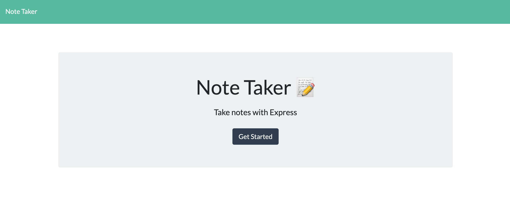
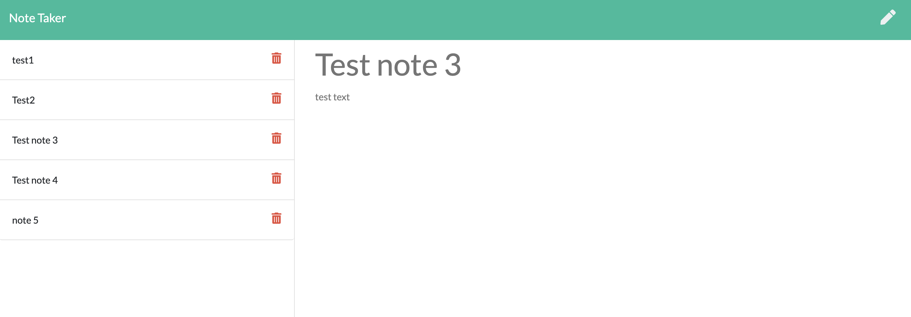
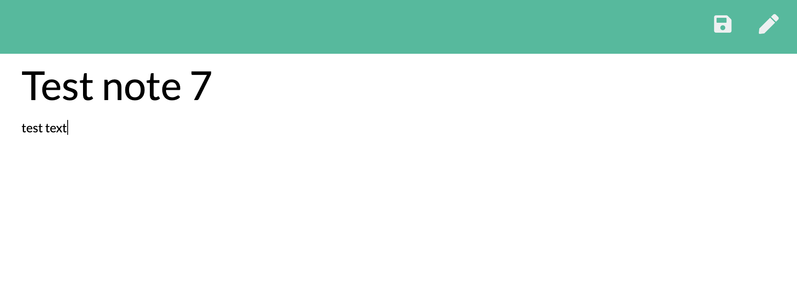

# noteTaker

## Table of Contents
  1. [Description](#description)
  2. [Image of product](#screenshots)
  3. [Usage](#usage)
  4. [Questions](#questions)
  
  
  
## Description 
This application is designed to allow the user to write, edit, and delete notes.  The notes that are saved will persist in the application until the user decides to delete them.  The full application can be found [here](https://boiling-temple-90514.herokuapp.com/)

## Image of product 

## Usage 
To use, open the app in your browser and click "get started."  From there, you can enter a new note, view previously saved notes, and delete previously saved notes.  When you enter text for a note, the save icon will appear in the top right corner.  You simply click it when you are ready to save your note.  To delete a note, click the red trashcan icon next to it.  To start a new note, click the pencil icon in the top right corner.

## Questions 
If you have any questions, you may reach out to me at richardwalter515@gmail.com
or visit me on [GitHub](https://www.github.com/richardwalter515)